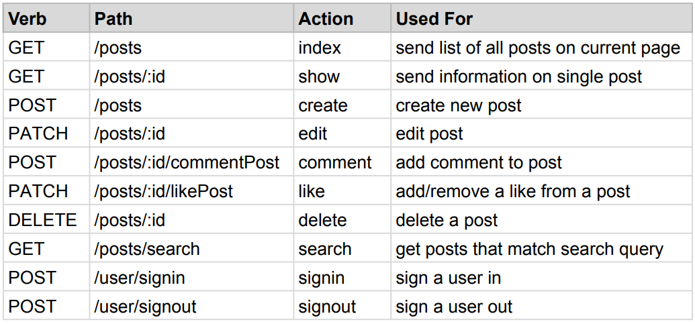
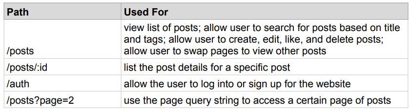

# MERN-Social-Media

<b>A Full-stack Social Media Application Using the MERN Stack</b>

<h2>Overview:</h2>

<h3>Features:</h3>

MERN-Social-Media is a fully functioning and deployed full-stack web application accessible on <a href="https://mern-socialmedia-ethanduong.netlify.app/posts">Netlify</a>. Users can authenticate using our custom authentication system or using Google Auth. Authenticated users can create new posts, like other posts, comment on other posts, and edit/delete their posts. Our home page allows users to view eight posts at a time. The home page is paginated meaning that users can view the next set of posts by moving to the next page. Furthermore, users can query posts based on title and/or tags and can view posts individually on a details page. In summary, our social-media application has full CRUD functionality and includes features such as search, authentication, pagination, comments, likes, and tag-based-post-recommendations.

<h3>Technologies:</h3>


As a full-stack web app, there are many parts/components that work together to make this application functional. We use React for our front-end, Node and Express for our back-end server (REST API), and MongoDB as our database. Furthermore, we use React-Router for client-side routing and Mongoose as our Object Document Mapper. Lastly, we use React-Redux to handle global state management. The above diagram demonstrates the high-level relationship that these technologies have with each other (minus redux). 

<h2>Back-End:</h2>
All back-end code is stored in a server folder. The server folder contains an additional git repository that is used for pushing our node server onto Heroku. The back-end section of this readme is split into database, server, and authentication sections. 
 
<h3>Database:</h3>
MongoDB and the Express server communicate via mongoose. Data is stored and retrieved according to the following mongoose schema(s): 

```
const postSchema = mongoose.Schema({
  title: String,
  message: String,
  creator: String,
  name: String,
  tags: [String],
  selectedFile: String,
  likes: {
    type: [String],
    default: [],
  },
  comments: {
    type: [String],
    default: [],
  },
  createdAt: {
    type: Date,
    default: new Date(),
  },
});

const userSchema = mongoose.Schema({
  name: {
    type: String,
    required: true,
  },
  email: {
    type: String,
    required: true,
  },
  password: {
    type: String,
    required: true,
  },
  id: { type: String },
});
```

Thus our database has two collections: one for users and one for posts. Instead of running our database locally during the development process, we opted for MongoDB’s free cloud service: MongoDB atlas. For our final product, we still use MongoDB atlas to host the database for this project.

<h3>Node Server:</h3>

Our server is an Express application that listens on a certain URL and accepts and sends data to/from the front-end in JSON formats.

Our express app listens on port localhost:5000 for local development and on this <a href=https://mernsocialmedia-ethanduong.herokuapp.com/>Heroku URL</a> during production. Express creates a REST API for the front-end to use on these previously mentioned URLs. Our front-end can access the API using the following server endpoints. As mentioned previously, data is sent and received as JSON. 



<h3>Authentication:</h3>

An additional layer of complexity we experienced during this project was dealing with user authentification. We use middleware to check whether or not a user is authenticated and limit their ability to like, edit, delete, comment, and create posts if they are not. 

We have two different styles of authentication: one with Google OAuth2 and another with our self-implemented auth that uses bcyrptjs and jsonwebtoken. In either case, when a user signs in they receive a token that expires in 1 hour. During the lifespan of the token users can do any of the previously mentioned signed-in-only actions. Once the token expires, both the front-end and backend will register the user as being logged out. If the user chooses to sign up using our custom auth, their password is first encrypted using bcryptjs and then logged into the database. Thus all passwords stored in our database are hashed (and thus unreadable for humans). 

<h2>Front-End:</h2>

All front-end code is stored in the client folder. The front-end can be ran locally using `$ npm start` or you can access the deployed version on <a href="https://mern-socialmedia-ethanduong.netlify.app/posts">Netlify</a>. The front-end section of this readme is split into routes and redux sections. 

<h3>Front-End Routes:</h3>



Routes on our front-end are handled by react-router. The router is responsible for loading components dynamically depending on the URL requested by the user. Pages accessible by the user are located in the table above. We have a section for front-end routes given that React-Router serves routes on the client side. That is, the front-end does not need to make a request to the back-end for any html or css: all styles and templates are handled client side. The server only serves JSON requested by our React components. The below image demonstrates how our router can serve components without accessing the web.


<h3>React Redux:</h3>

Lastly, we use Redux to handle our global post and auth states. We made it so that our redux actions use Axios to make calls to our back-end API. Thus our actions can pass on any data received from our database to our reducers which subsequently store the data into our global store. Use of Redux made our React application highly scalable as any component is now able to gain access to valuable post/authenitcation data from our database. The below image gives a rough overview of the Redux workflow. Out of the new technologies I learned during this project, Redux is my favorite.


